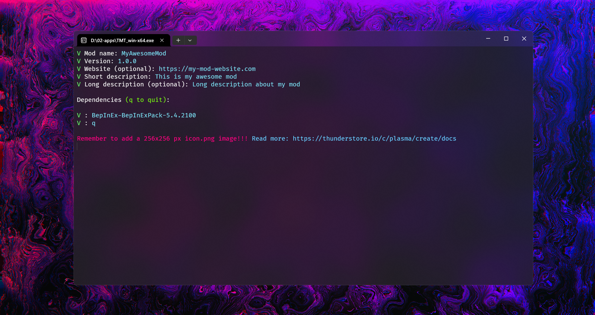

<h1 align="center">ThunderStoreModTemplateGenerator</h1>

Generate the required files for a Thunderstore mod to be published

## Introduction

ThunderStoreModTemplateGenerator is a command-line tool designed to simplify the process of creating the necessary files for publishing a mod on [Thunderstore.io](https://thunderstore.io/). This tool automates the creation of mod metadata and directory structure, allowing modders to focus on developing their mods rather than dealing with repetitive setup tasks.

## How to Use

1. **Download**:

    - Download the executable for your operating system from the [releases page](https://github.com/madkarmaa/ThunderStoreModTemplateGenerator/releases/latest).

2. **Run**:

    - Execute the downloaded executable.

3. **Fill in information**:

    - Follow the prompts to provide information about your mod.

4. **Generate files**:

    - The program will automatically generate the necessary files and directory structure for your mod.

5. **Access generated files**:
    - The files are created in a folder named after your mod's name, within the directory where the executable is run.

## Screenshots

## Dependencies

ThunderStoreModTemplateGenerator does not require any external dependencies. Simply download the executable, and you're ready to go!

## Contributing

Contributions to ThunderStoreModTemplateGenerator are welcome! If you find any issues or have suggestions for improvements, please feel free to open an issue or submit a pull request.

## License

This project is licensed under the [MIT License](./LICENSE).
